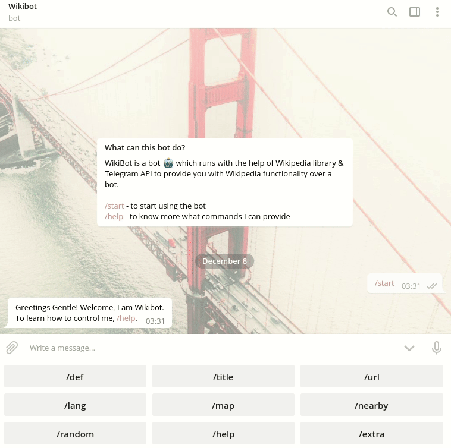
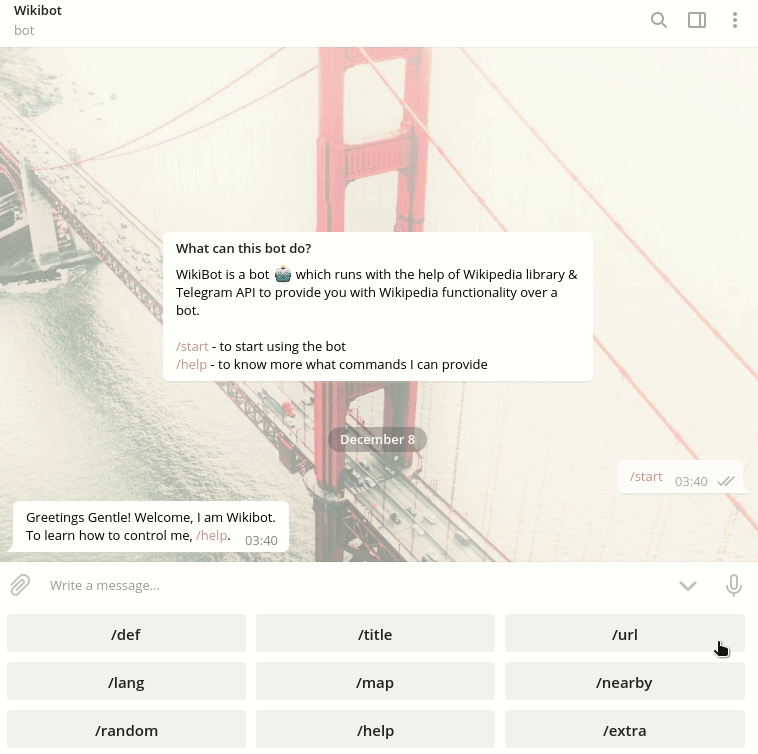
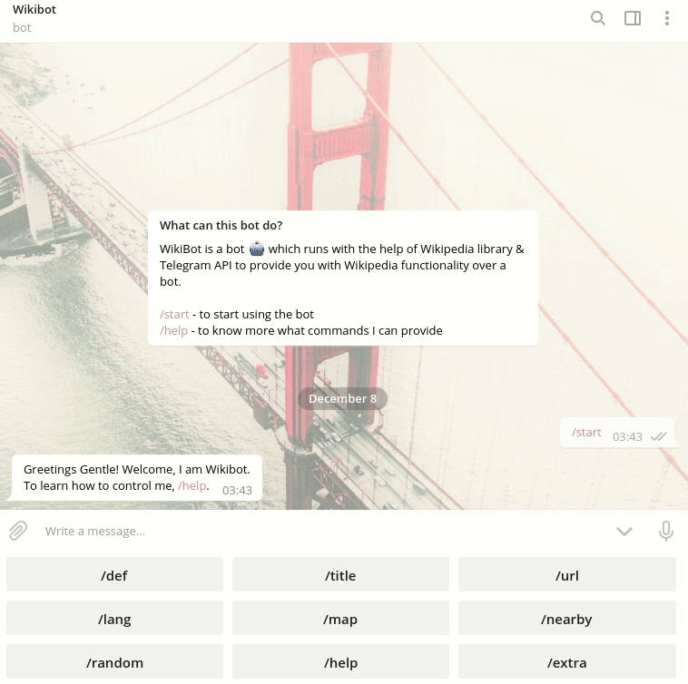
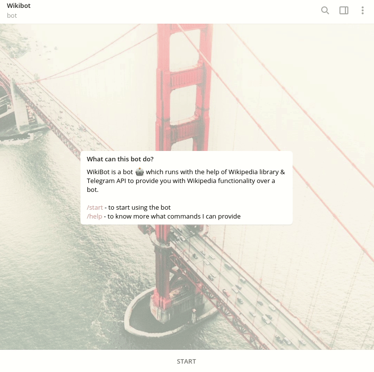

<p align="center">
 <a href="https://deepsource.io/gh/themagicalmammal/wikibot/?ref=repository-badge" target="_blank"></a>
<a href="https://deepsource.io/gh/themagicalmammal/wikibot/?ref=repository-badge" target="_blank"></a> <br >
<a href="https://github.com/themagicalmammal/wikibot"></a> 
<br />
<a href="LICENSE"></a>
<a href="https://www.python.org/"></a>
<a href="https://github.com/themagicalmammal/wikibot/pulls"></a>
<a href="https://telegram.me/themagicalmammal"></a>
<br />
<a href="https://lgtm.com/projects/g/themagicalmammal/wikibot/alerts/"></a>
<a href="https://lgtm.com/projects/g/themagicalmammal/wikibot/context:python"></a>
<br />
This :robot: is made in python with the help of the Wiki library.
<br /> <br />
<a href="https://flask.palletsprojects.com/en/1.1.x/"></a>
<a href="https://id.heroku.com/login"></a>
<a href="https://firebase.google.com/"></a>
</p>

### Table of Contents

- [Intro](#intro)
- [Bot Commands](#bot-commands)
  - [Def](#1-def)
  - [Title](#2-title)
  - [URL](#3-url)
  - [Lang](#4-lang)
  - [Map](#5-map)
  - [Nearby](#6-nearby)
  - [Random](#7-random)
  - [Others](#8-others)
- [Test](#test)
- [Contributors](#contributors)

## Intro

While researching about bots, I found out that, there existed no bot that could do more than showing the definition of a word. But, Wiki can do a lot more than just showing a definition. Thus, this bot was made with the sole purpose of showing what Wiki can do.  <br />

<p align="center">
<a href="https://telegram.me/pro_wikibot"></a>
</p>

## Bot Commands

### 1. Def

Short form of definition. Fetches wiki definition for your word.

```python
/def
```

<p align="center">
<a></a>
</p>

### 2. Title

Shows a list of possible titles that you can search from a word.

```python
/title
```

<p align="center">
<a></a>
</p>

### 3. URL

Provides you with the URL of the wiki page for a word.

```python
/url
```

<p align="center">
<a></a>
</p>

### 4. Lang

Change to your local language which will be used for every wiki output.

```python
/lang
/prefix
```

<p align="center">
<a></a>
</p>

### 5. Map

Provides you with the location of your input place with Wiki-API.

```python
/map
```

<p align="center">
<a></a>
</p>

### 6. Nearby

With the help of coordinates provides you with nearby locations under 1km.

```python
/nearby
```

<p align="center">
<a></a>
</p>

### 7. Random

Sends you a random wiki link.

```python
/random
```

<p align="center">
<a></a>
</p>

### 8. Others

Some other set of commands that wikibot provides.

```python
/help
/extra
/spot
/suggest
/dev
/source
/issues
```

<p align="center">
<a></a>
</p>

## Test

To test this bot. You can follow these steps:

1. Setup a Bot with **[BotFather](https://t.me/botfather)**.
1. Put your **Token** in

```python
TOKEN = ""
```

3. Setup **RTDB** in **[Firebase](https://firebase.google.com/)**.
1. Download your **key file**, place it next to your bot file

```python
cred = credentials.Certificate("xxxYOURKEYFILExxx.json")
```

5. Paste your RTDB url in

```python
firebase_admin.initialize_app(
    cred, {"databaseURL": "https://yourappname-user-default-rtdb.firebaseio.com/"}
)
```

6. Setup a project in **Heroku**.
1. Paste your Project url in

```python
bot.set_webhook(url="https://yourappname.herokuapp.com/" + TOKEN)
```

8. Files you need for Heroku

```heroku
xxxYOURKEYFILExxx.json #firebase key
Procfile
bot.py
requirements.txt
```

9. To resolve bugs

```heroku
Heroku --logs
```

## Contributors

#### [kurkurzz](https://github.com/kurkurzz) - Introducing the keyboard & some optimized commands.
